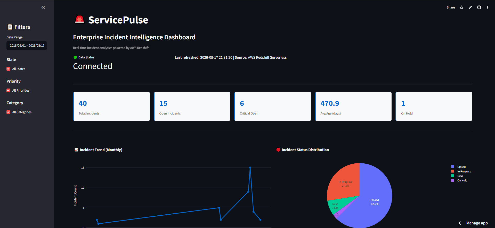
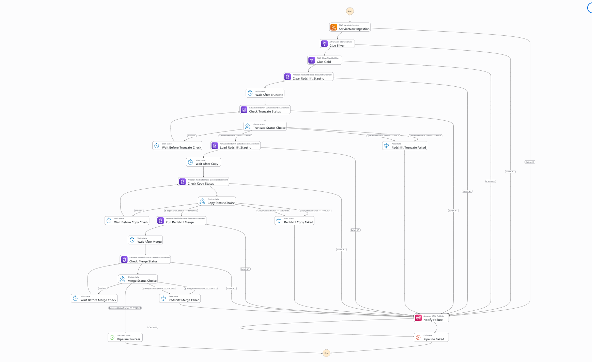
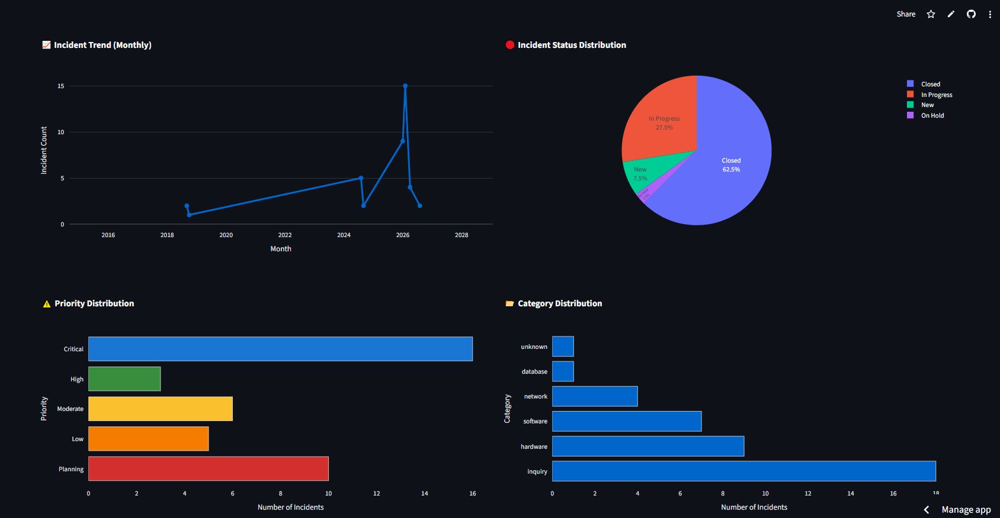
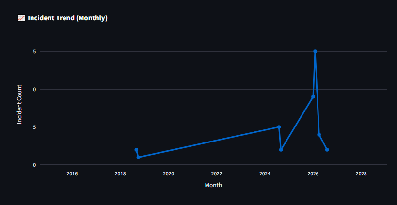
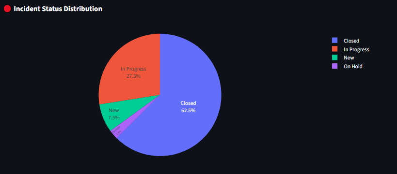
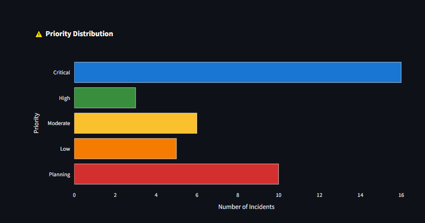
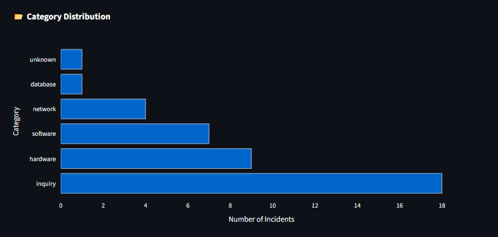
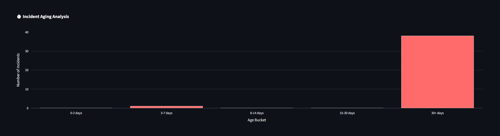
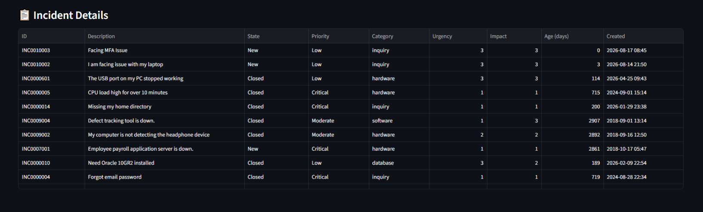

# ServicePulse

> **Enterprise Incident Data Engineering & Analytics Platform on AWS**

ServicePulse is an end-to-end cloud data engineering platform for ingesting, processing, validating, warehousing, monitoring, and analyzing enterprise ticket data.

The platform follows a production-oriented **Bronze → Silver → Gold** architecture and integrates AWS serverless services with Python data engineering components and an interactive Streamlit analytics application.



---

## Table of Contents

- [Overview](#overview)
- [Architecture](#architecture)
- [Data Flow](#data-flow)
- [AWS Services](#aws-services)
- [Repository Structure](#repository-structure)
- [Data Architecture](#data-architecture)
- [Pipeline Components](#pipeline-components)
- [Data Warehouse](#data-warehouse)
- [Analytics Dashboard](#analytics-dashboard)
- [Security](#security)
- [Observability & Alerting](#observability--alerting)
- [Configuration & Secrets](#configuration--secrets)
- [Local Development](#local-development)
- [Testing](#testing)
- [Deployment](#deployment)
- [Operational Workflow](#operational-workflow)
- [Engineering Practices](#engineering-practices)
- [CI/CD](#cicd)
- [Roadmap](#roadmap)
- [Project Status](#project-status)
- [Portfolio Highlights](#portfolio-highlights)
- [Author](#author)

---

## Overview

ServicePulse transforms enterprise ticket data into a reliable analytical dataset and operational dashboard.

The implemented platform covers the complete path:

```text
ServiceNow
    ↓
EventBridge
    ↓
Step Functions
    ↓
AWS Lambda
    ↓
Amazon S3 - Bronze
    ↓
AWS Glue / PySpark
    ↓
Amazon S3 - Silver
    ↓
Data Quality
    ↓
Amazon Redshift Serverless - Gold
    ↓
Redshift Data API
    ↓
Streamlit
    ↓
Operational Analytics
```

The platform also includes:

```text
IAM
Secrets Manager
CloudWatch
SNS
GitHub
Pytest
```

This makes ServicePulse more than a dashboard: it demonstrates an end-to-end **data ingestion, transformation, warehousing, observability, security, and analytics workflow**.

---

# Architecture

## High-Level Architecture

```text
                              ┌─────────────────────┐
                              │      ServiceNow     │
                              │      REST API       │
                              └──────────┬──────────┘
                                         │
                                         ▼
                              ┌─────────────────────┐
                              │    EventBridge      │
                              │     Scheduler       │
                              └──────────┬──────────┘
                                         │
                                         ▼
                              ┌─────────────────────┐
                              │   Step Functions    │
                              │    Orchestration    │
                              └──────────┬──────────┘
                                         │
                                         ▼
                              ┌─────────────────────┐
                              │       Lambda        │
                              │   Ingestion Layer   │
                              └──────────┬──────────┘
                                         │
                                         ▼
                              ┌─────────────────────┐
                              │      S3 BRONZE      │
                              │      Raw Data       │
                              └──────────┬──────────┘
                                         │
                                         ▼
                              ┌─────────────────────┐
                              │     AWS Glue        │
                              │      PySpark        │
                              │  Transformations    │
                              └──────────┬──────────┘
                                         │
                                         ▼
                              ┌─────────────────────┐
                              │      S3 SILVER      │
                              │ Clean / Standardized│
                              │    Parquet Data     │
                              └──────────┬──────────┘
                                         │
                                         ▼
                              ┌─────────────────────┐
                              │    Data Quality     │
                              │   Validation Layer  │
                              └──────────┬──────────┘
                                         │
                                         ▼
                              ┌─────────────────────┐
                              │ Amazon Redshift     │
                              │      Serverless     │
                              │      GOLD / DWH     │
                              └──────────┬──────────┘
                                         │
                              Redshift Data API
                                         │
                                         ▼
                              ┌─────────────────────┐
                              │     Streamlit       │
                              │ ServicePulse        │
                              │ Analytics Dashboard  │
                              └─────────────────────┘


     ┌─────────────────────────────────────────────────────────────┐
     │              Platform Security & Operations                 │
     │                                                             │
     │  IAM │ Secrets Manager │ CloudWatch │ SNS │ Logging         │
     └─────────────────────────────────────────────────────────────┘
```

---

# Data Flow

## End-to-End Pipeline

### 1. Source

Incident records originate from the enterprise incident source / ServiceNow API.

### 2. Scheduling

Amazon EventBridge initiates the scheduled pipeline execution.

### 3. Orchestration

AWS Step Functions controls the workflow, including execution sequencing and failure/retry handling.

### 4. Ingestion

AWS Lambda retrieves incident data and handles the ingestion process.

### 5. Bronze Layer

Raw data is persisted in Amazon S3.

The Bronze layer preserves source-level information for traceability and replayability.

### 6. Transformation

AWS Glue with PySpark processes the raw dataset.

Typical processing includes:

- Schema normalization
- Data type conversion
- Null handling
- Deduplication
- Timestamp handling
- Derived fields
- Data standardization

### 7. Silver Layer

The transformed dataset is stored in S3 as cleaned, analytics-ready data.

### 8. Data Quality

Data quality validation is applied before loading analytical data into the warehouse.

### 9. Gold Layer

Amazon Redshift Serverless stores the business-ready analytical dataset.

### 10. Analytics

The Streamlit application retrieves data through the Redshift Data API and presents operational insights.

---

# AWS Services

| Service | Responsibility |
|---|---|
| Amazon EventBridge | Pipeline scheduling |
| AWS Step Functions | Workflow orchestration |
| AWS Lambda | Serverless ingestion / processing |
| Amazon S3 | Bronze and Silver data lake layers |
| AWS Glue | ETL and PySpark transformations |
| AWS Glue Data Catalog | Metadata / schema management |
| Amazon Redshift Serverless | Gold analytical warehouse |
| Redshift Data API | Application-to-warehouse access |
| AWS Secrets Manager | Secure database credentials |
| AWS IAM | Authentication and authorization |
| Amazon CloudWatch | Logs and operational monitoring |
| Amazon SNS | Operational notifications and alerts |

---

# Repository Structure

The repository follows a layered structure separating ingestion, business logic, persistence, analytics, infrastructure-related assets, and tests.

```text
SERVICEPULSE/
│
│
├── .github/
│   └── ...                         # GitHub workflows / repository automation
│
├── .streamlit/
│   └── secrets.toml                # Local Streamlit secrets (NOT committed)
│
├── glue/
│   └── ...                         # AWS Glue / PySpark ETL jobs
│
├── lambda_build/
│   └── ...                         # Lambda build / packaging artifacts
│
├── src/
│   ├── ingestion/
│   │   └── ...                     # Source/API ingestion components
│   │
│   ├── repositories/
│   │   └── ...                     # Data access / persistence layer
│   │
│   ├── services/
│   │   └── ...                     # Business/application services
│   │
│   ├── __init__.py
│   └── handler.py                  # Lambda entry point
│
├── streamlit_app/
│   ├── app.py                      # Streamlit application
│   ├── config.py                   # Application configuration
│   ├── database.py                 # Redshift Data API client
│   └── queries.py                  # Analytical SQL queries
│
├── tests/
│   └── ...                         # Automated tests
│
├── .env.example                    # Environment variable template
├── .gitignore
├── pytest.ini
├── README.md
└── requirements.txt                # Backend / pipeline dependencies
```

### Layer Responsibilities

```text
src/
 │
 ├── ingestion/       → Extract data from source systems
 │
 ├── services/        → Business logic and orchestration
 │
 └── repositories/    → Persistence and AWS data access

glue/
 │
 └── ETL              → Transform Bronze → Silver

streamlit_app/
 │
 ├── database.py      → Redshift connectivity
 ├── queries.py       → SQL abstraction
 └── app.py           → Analytics presentation

tests/
 │
 └── Validation       → Automated quality checks
```

---

# Data Architecture

ServicePulse follows a **Medallion Architecture**.

```text
                    DATA LAKE / WAREHOUSE

┌─────────────────────────────────────────────────────────┐
│ BRONZE                                                  │
│                                                         │
│ Raw ServiceNow / Incident Data                          │
│ Amazon S3                                               │
└───────────────────────────┬─────────────────────────────┘
                            │
                            ▼
┌─────────────────────────────────────────────────────────┐
│ SILVER                                                  │
│                                                         │
│ Cleaned + Standardized + Validated Data                 │
│ Amazon S3 / Parquet                                     │
└───────────────────────────┬─────────────────────────────┘
                            │
                            ▼
┌─────────────────────────────────────────────────────────┐
│ GOLD                                                    │
│                                                         │
│ Business-ready analytical datasets                      │
│ Amazon Redshift Serverless                              │
└───────────────────────────┬─────────────────────────────┘
                            │
                            ▼
                  ServicePulse Analytics
```

## Bronze

Purpose:

- Preserve raw source data
- Maintain traceability
- Support replay/reprocessing
- Retain historical source information

## Silver

Purpose:

- Standardize schema
- Clean records
- Apply transformations
- Normalize timestamps
- Handle missing values
- Remove duplicates
- Store optimized Parquet data

## Gold

Purpose:

- Provide analytical datasets
- Support dashboard queries
- Support BI workloads
- Provide a foundation for downstream ML

---

# Pipeline Components

## ServiceNow Ingestion

The ingestion layer is responsible for retrieving incident information from the source system.

Responsibilities include:

- API communication
- Authentication
- Request handling
- Pagination
- Incremental extraction
- Error handling
- Data handoff to the AWS pipeline

---

## EventBridge

EventBridge provides scheduled execution of the data pipeline.

```text
Schedule
   ↓
EventBridge
   ↓
Step Functions
```

This removes the need for manual pipeline execution.

---

## Step Functions

Step Functions coordinates the pipeline workflow.

Conceptually:

```text
Start
  ↓
Ingestion
  ↓
Validation
  ↓
S3 Bronze
  ↓
Glue Transformation
  ↓
S3 Silver
  ↓
Data Quality
  ↓
Redshift Load
  ↓
Success
```




Failure paths and retries are handled at the orchestration layer.

---

## AWS Lambda

Lambda provides serverless execution for ingestion and application-level pipeline logic.

The repository entry point is:

```text
src/handler.py
```

The implementation is designed around modular ingestion, service, and repository layers rather than placing the entire workflow inside a single Lambda function.

---

## AWS Glue / PySpark

Glue performs distributed transformation of the raw incident data.

The transformation layer is maintained under:

```text
glue/
```

The resulting data is written to the Silver layer in an analytics-friendly format.

---

# Data Warehouse

## Amazon Redshift Serverless

Redshift Serverless acts as the Gold analytical warehouse.

Current application configuration:

```text
Database: dev
Schema:   servicepulse
Table:    fact_incidents
```

The incident fact dataset contains attributes such as:

```text
incident_id
incident_number
short_description
state
state_label
priority
priority_label
urgency
impact
category
subcategory
created_at
updated_at
incident_age_days
```

---

## Redshift Data API

The Streamlit application uses the Redshift Data API instead of maintaining a traditional persistent database connection.

```text
ExecuteStatement
       ↓
DescribeStatement
       ↓
GetStatementResult
       ↓
Pandas DataFrame
```

This is well suited to the serverless application architecture.

---

# Analytics Dashboard

ServicePulse provides an interactive operational analytics dashboard built with Streamlit.



## Executive KPIs

The dashboard provides:

- Total Incidents
- Open Incidents
- Critical Incidents
- Average Incident Age
- On Hold Incidents

## Interactive Filters

Users can filter the analytics by:

- Date Range
- Incident State
- Priority
- Category

## Visual Analytics

The dashboard includes:

### Incident Trend



Incident creation volume over time.

### Incident Status Distribution



Distribution across:

- Closed
- In Progress
- New
- On Hold

### Priority Distribution



Analysis across:

- Critical
- High
- Moderate
- Low
- Planning

### Category Distribution



Analysis across incident categories such as:

- Inquiry
- Hardware
- Software
- Network
- Database
- Unknown

### Incident Aging



Aging buckets include:

```text
0–2 days
3–7 days
8–14 days
15–30 days
30+ days
```

### Incident Details



The dashboard exposes incident-level details including:

- Incident ID
- Incident Number
- Description
- State
- Priority
- Category
- Urgency
- Impact
- Age
- Created Date

---

# Application Layer

The Streamlit application is intentionally separated into configuration, database access, SQL, and presentation layers.

```text
streamlit_app/
│
├── app.py
│      │
│      ├── Dashboard
│      ├── Filters
│      ├── KPIs
│      └── Visualizations
│
├── database.py
│      │
│      └── Redshift Data API
│
├── queries.py
│      │
│      └── Analytical SQL
│
└── config.py
       │
       └── Runtime configuration
```

Streamlit caching is used to reduce unnecessary repeated warehouse queries:

```python
@st.cache_data(ttl=300)
def load_incidents():
    client = RedshiftClient()
    return client.execute_query(get_incidents_query())
```

---

# Security

Security is implemented using AWS-native mechanisms.

## IAM

IAM is used to control access to AWS resources.

The application and pipeline use role/user permissions appropriate to the required AWS operations.

## AWS Secrets Manager

Redshift credentials are stored in AWS Secrets Manager rather than hardcoded in source code.

The application references the secret through its configured secret ARN.


# Observability & Alerting

ServicePulse includes operational monitoring through AWS CloudWatch and notification through SNS.

## CloudWatch

CloudWatch is used for operational visibility into AWS workloads.

Monitoring covers relevant execution and application logs for services such as:

- Lambda
- Step Functions
- Glue
- Other AWS pipeline components

## SNS

Amazon SNS is used to deliver operational notifications for configured pipeline/application events.

Conceptually:

```text
AWS Service
    ↓
CloudWatch / Pipeline Event
    ↓
SNS
    ↓
Notification
```

This provides an operational feedback loop rather than relying only on manual log inspection.

---

# Configuration & Secrets

The project separates configuration from application logic.

## `.env.example`

Contains the expected environment variable structure without exposing credentials.


## `.streamlit/secrets.toml`

Contains local Streamlit runtime secrets and must not be committed.

## AWS Secrets Manager

Stores sensitive Redshift credentials used by the application.

### Example Configuration

```toml
AWS_ACCESS_KEY_ID = "YOUR_AWS_ACCESS_KEY"
AWS_SECRET_ACCESS_KEY = "YOUR_AWS_SECRET_KEY"
AWS_DEFAULT_REGION = "ap-south-1"

REDSHIFT_SECRET_ARN = "YOUR_REDSHIFT_SECRET_ARN"

REDSHIFT_WORKGROUP = "servicepulse-workgroup"
REDSHIFT_DATABASE = "dev"
REDSHIFT_SCHEMA = "servicepulse"
REDSHIFT_TABLE = "fact_incidents"
```

> Never replace placeholders with real credentials in documentation or commit them to Git.

---

# Local Development

## Prerequisites

- Python 3.12
- Git
- AWS account
- Appropriate AWS permissions
- Redshift Serverless environment
- AWS Secrets Manager secret
- Docker, if using the local Lambda build workflow

## Clone

```bash
git clone <YOUR_GITHUB_REPOSITORY_URL>
cd servicepulse
```

## Virtual Environment

```bash
python -m venv venv
```

Windows PowerShell:

```powershell
.\venv\Scripts\Activate.ps1
```

## Install Dependencies

For the pipeline/backend:

```bash
pip install -r requirements.txt
```

For the Streamlit application:

```bash
pip install -r requirements-streamlit.txt
```

## Run Streamlit

```bash
streamlit run streamlit_app/app.py
```

Application:

```text
http://localhost:8501
```

---

# Testing

The project includes a dedicated test suite under:

```text
tests/
```

Pytest is used as the testing framework.

Run:

```bash
pytest
```

For more detailed output:

```bash
pytest -v
```

The project also includes:

```text
pytest.ini
```

for test configuration.

---

# AWS Connectivity Validation

The repository includes:

```text
test_aws.py
```

for validating AWS connectivity/configuration during development.

This type of integration validation helps verify:

- AWS authentication
- Secrets Manager access
- AWS region configuration
- Required runtime configuration

Production credentials should always be provided through secure configuration mechanisms.

---

# Deployment

## Lambda

Lambda deployment artifacts are maintained under:

```text
lambda_build/
```

and the packaged deployment artifact:

```text
servicepulse-lambda.zip
```

The Lambda runtime uses:

```text
src/handler.py
```

as the application entry point.

## AWS Pipeline

The production pipeline is composed of:

```text
EventBridge
     ↓
Step Functions
     ↓
Lambda
     ↓
S3
     ↓
Glue
     ↓
S3
     ↓
Redshift
```

## Streamlit Cloud

The Streamlit application is deployed through Streamlit Community Cloud.

Live application:

**https://servicepulseai.streamlit.app/**

Deployment flow:

```text
GitHub
   ↓
Streamlit Community Cloud
   ↓
Streamlit Application
   ↓
AWS Services
```

---

# Operational Workflow

The complete operational lifecycle is:

```text
             ┌──────────────────┐
             │    Schedule      │
             └────────┬─────────┘
                      ▼
             ┌──────────────────┐
             │   EventBridge    │
             └────────┬─────────┘
                      ▼
             ┌──────────────────┐
             │ Step Functions   │
             └────────┬─────────┘
                      ▼
             ┌──────────────────┐
             │     Lambda       │
             └────────┬─────────┘
                      ▼
             ┌──────────────────┐
             │    S3 Bronze     │
             └────────┬─────────┘
                      ▼
             ┌──────────────────┐
             │   AWS Glue       │
             │    PySpark       │
             └────────┬─────────┘
                      ▼
             ┌──────────────────┐
             │    S3 Silver     │
             └────────┬─────────┘
                      ▼
             ┌──────────────────┐
             │  Data Quality    │
             └────────┬─────────┘
                      ▼
             ┌──────────────────┐
             │ Redshift Gold    │
             └────────┬─────────┘
                      ▼
             ┌──────────────────┐
             │    Streamlit     │
             └──────────────────┘

              ┌─────────────────┐
              │ CloudWatch      │
              │ + SNS           │
              └─────────────────┘
```

---

# Engineering Practices

ServicePulse follows production-oriented engineering principles:

### Separation of Concerns

Ingestion, services, repositories, transformations, database access, SQL, and presentation are separated.

### Serverless First

AWS managed/serverless services are used where appropriate to reduce infrastructure management overhead.

### Idempotent Processing

Pipeline components are designed to avoid duplicate processing and support safe re-execution.

### Incremental Processing

The pipeline is designed around incremental data movement rather than repeatedly processing the entire dataset.

### Observability

CloudWatch and SNS provide operational visibility and notifications.

### Secure Configuration

Credentials are externalized through AWS Secrets Manager and environment-specific secret configuration.

### Testability

Application and pipeline logic are organized so that components can be validated independently.

### Reproducibility

Dependency files and structured configuration support repeatable development and deployment.


# Roadmap

## ML Extension

- [ ] Incident classification
- [ ] SLA breach prediction
- [ ] Feature engineering pipeline
- [ ] Model training
- [ ] Model registry
- [ ] Model deployment
- [ ] Model monitoring

---

# Highlights

ServicePulse demonstrates practical experience across the modern data engineering lifecycle:

```text
API Integration
      ↓
Serverless Ingestion
      ↓
Workflow Orchestration
      ↓
Data Lake
      ↓
Distributed ETL
      ↓
Data Quality
      ↓
Data Warehouse
      ↓
Secure Data Access
      ↓
Observability
      ↓
Operational Alerting
      ↓
Analytics Application
```

### Key Skills Demonstrated

**Data Engineering**

- ETL / ELT
- Incremental data processing
- Data lake architecture
- Medallion architecture
- Data quality
- Data warehouse design

**AWS**

- Lambda
- Step Functions
- EventBridge
- S3
- Glue
- Redshift Serverless
- Secrets Manager
- IAM
- CloudWatch
- SNS

**Python**

- Modular architecture
- API integration
- Repository pattern
- Service layer
- Data processing
- Automated testing

**Analytics**

- Pandas
- Plotly
- Streamlit
- KPI design
- Operational analytics

**Engineering**

- Git / GitHub
- Environment configuration
- Secure secrets management
- Testing
- Serverless architecture
- Production-oriented project structure

---

# Future ML Platform

The curated incident data provides a foundation for machine learning use cases.

## Incident Classification

```text
Incident Description
        ↓
NLP / ML Model
        ↓
Category / Subcategory
        ↓
Assignment / Routing
```

## SLA Breach Prediction

```text
Incident Features
        ↓
ML Model
        ↓
SLA Breach Probability
        ↓
Operational Alert
```

These capabilities can be added on top of the existing Gold-layer analytical data without redesigning the core ingestion pipeline.

---

# Author

**Ravi Kumar**

AI/ML Engineer

---

> **ServicePulse - From enterprise incident data to production-ready analytics.**
